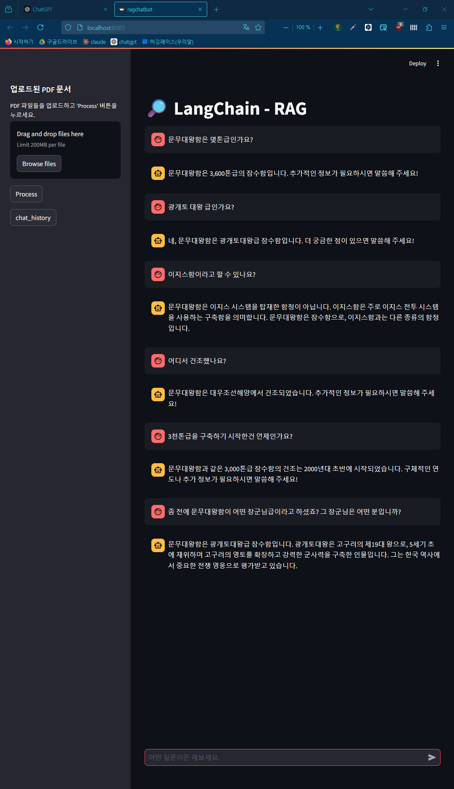
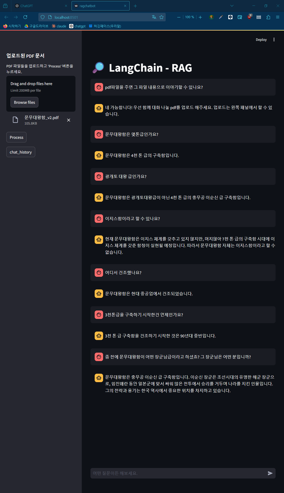
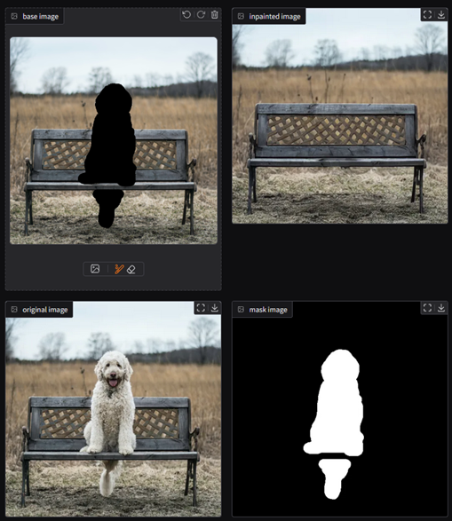
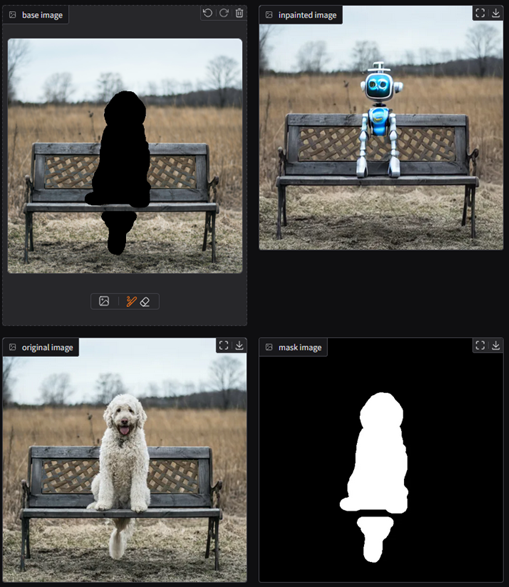
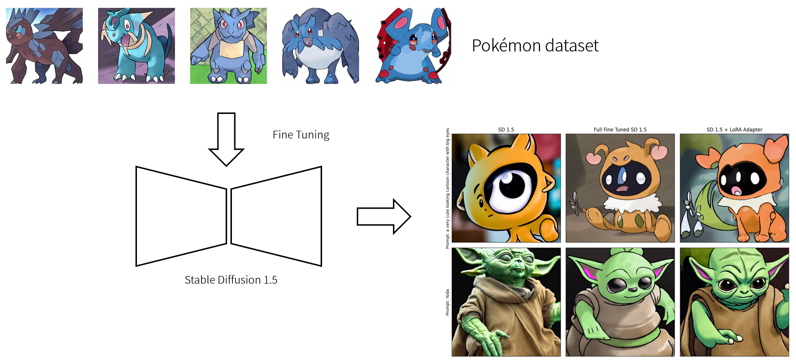

# Generative AI Fundamental Course Repository

This repository is designed to provide fundametal knowledge and practical skills in generative AI, including Transformer models, Large Language Models, and Image Generative AI.
이 리포지토리는 트랜스포머 모델, 대규모 언어 모델, 이미지 생성 AI 등 생성 AI의 기초적인 지식과 실무 기술을 제공하기 위해 설계되었습니다.

This content is part of the **Zero to AI Master** program conducted by **Daegu AI-Hub**.
이 콘텐츠는 **대구 AI 허브**에서 진행하는 **제로 투 AI 마스터** 프로그램의 일환입니다.

---

## 📚 **Course Contents**

### 1. **Transformer**
- **Deep Dive into Transformer Models**  
  Detailed analysis and understanding of the Transformer architecture. 트랜스포머 아키텍처에 대한 자세한 분석과 이해
- **Predicting Simple Sequences with Transformers**  
  Using torch.nn.Transformer to Predict Simple Sequences. 간단한 수열을 예측하기 위한 torch.nn.Transformer 사용법 
- **Fine-Tuning GPT-2 for News Headline Generation**  
  Hands-on project to generate news headlines by fine-tuning GPT-2. GPT-2를 미세 조정하여 뉴스 헤드라인을 생성하는 실습 프로젝트
- **Fine-Tuning BERT for NSMC Classification**  
  Hands-on with fine-tuning BERT with Naver Sentiment Movie Corpus (NSMC) 네이버 감성 무비 코퍼스(NSMC)로 BERT를 파인튜닝하는 실습

---

### 2. **Large Language Models (LLMs)**
- **Key Technologies Leading to LLMs**  
  A review of essential advancements that enabled the development of LLMs. LLM의 발전을 가능하게 한 필수적인 과정 대한 리뷰
- **Utilizing OpenAI API and Prompt Engineering**  
  Practical usage of ChatGPT and prompt engineering techniques. ChatGPT API의 실제 사용법과 프롬프트 엔지니어링 기법.
- **LangChain Basics and RAG App Development**  
  Introduction to LangChain and a project for building a Retrieval-Augmented Generation (RAG) application. LangChain 소개 및 검색 증강 세대(RAG) 애플리케이션 구축 프로젝트
  

    

      
      
without RAG

    

    

      
      
with RAG

    

  

---

### 3. **Image Generative AI**
- **Introduction to AutoEncoders and Variational AutoEncoders**  
  Theory and hands-on sessions for understanding AutoEncoders and VAE. 자동 인코더와 VAE를 이해하기 위한 이론 및 실습
- **Denoising Diffusion Models**  
  - Overview of Denoising Diffusion Probabilistic Models (DDPM). 노이즈 제거 확산 확률 모델(DDPM) 개요
  - Proof-of-Concept (PoC) implementation of unconditional DDPM. 무조건 DDPM의 개념 증명(PoC) 구현.  
  - PoC implementation of conditional DDPM. 조건부 DDPM의 개념 증명(PoC) 구현.  
- **Latent Diffusion Models (LDMs)**  
  - Introduction to LDMs and their applications. LDM과 그 활용에 대한 소개
  - PoC implementation of unconditional and conditional LDM. 무조건 및 조건부 LDM의 PoC 구현
- **HuggingFace 🤗Diffusers Framework**  
  - Introducing 🤗Diffusers Library for Image Generation Tasks. 이미지 생성 작업을 위한 디퓨저 라이브러리 소개
  - Training an Image Generation Model with 🤗Diffusers. 디퓨저 라이브러리를 이용한 이미지 생성 모델 학습
  - Exploring different 🤗Diffusers pipelines and building an in-painting app project. 다양한 디퓨저 파이프라인을 탐색 및 인페인팅 앱 제작 프로젝트 
 
  | without Prompt            | with Prompt                    |
  |---------------------------|--------------------------------|
  |  |  |
  | None |  A small robot, high resolution, sitting on a park bench |

- **Stable Diffusion Fine-Tuning**  
  - SD 1.5 Model Full Fine-Tuning 스테이블 디퓨전 1.5 풀 파인튜닝
  - LoRA adapter training using PEFT (Parameter Efficient Fine-Tuning). 스테이블 디퓨전 1.5 LoRA를 이용한 파인튜닝
    

    

      
      
without RAG

    

  

---

## 📝 **License**
This repository is licensed under the MIT License. Feel free to use and adapt the materials for educational purposes.

---

## 📧 **Contact**
For questions or further information, please reach out to:  
📩 Email: metamath@gmail.com
🌐 Website: [https://metamath1.github.io/blog](https://metamath1.github.io/blog)